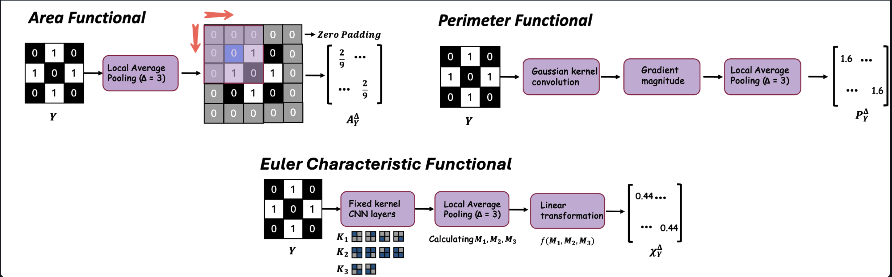
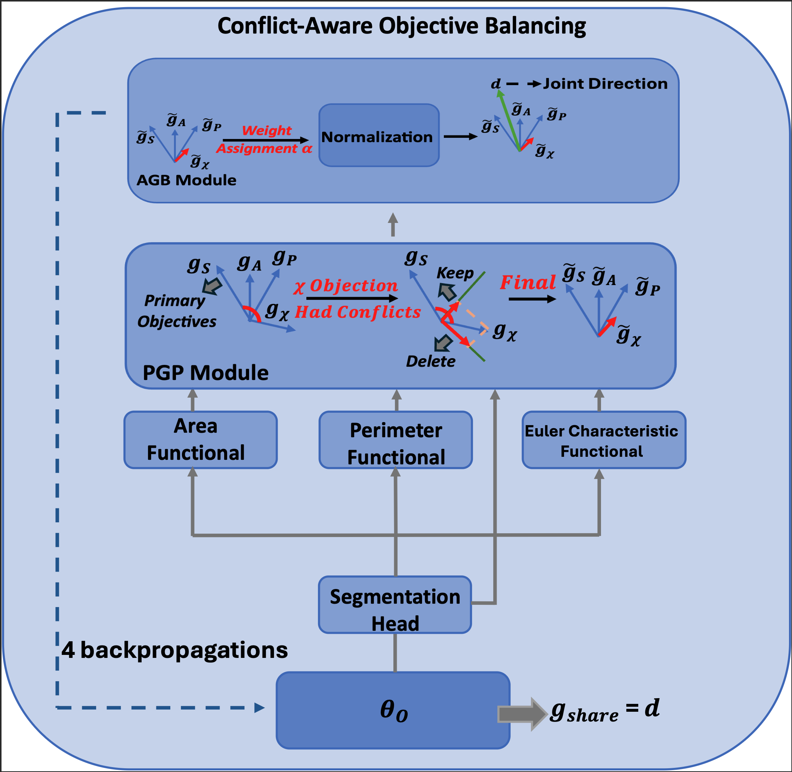

# Hadwiger Shape Priors with Conflict-Aware Objective Balancing for Generalizable Biomedical Image Segmentation

This repository contains the official implementation of HadBalance, a plug-and-play geometry-prior module for biomedical image segmentation. It seamlessly injects Hadwiger shape constraints into the training process while adaptively resolving gradient conflicts.

---

## **Dataset:**

We conducted our experiments on the [CUBS](https://data.mendeley.com/datasets/m7ndn58sv6/1), [CVC-ClinicDB](https://www.kaggle.com/datasets/orvile/cvc-clinicdb), and [DRIONS-DB](https://www.idiap.ch/software/bob/docs/bob/bob.db.drionsdb/master/index.html) datasets.

---

## **Algorithm Description:**

The implementation of the Hadwiger module is illustrated in the figure above. For detailed code, please refer to hadwiger.py.

The Conflict-Aware Objective Balancing (COAB) mechanism consists of two core modules: PGP and AGB. Specifically, PGP is responsible for filtering out harmful conflicting gradients (determining the optimal direction), while AGB calculates the optimal fusion weights for the remaining safe directions (determining the step size). Working in tandem, they constitute the robust COAB framework. For more details, please refer to the source code pgp.py and agb.py.

---

## **Implementation Details:**
Our model is plug-and-play and can be seamlessly integrated with any state-of-the-art segmentation model.

### 🛠️ Integration Guide & Implementation Tips

The **HadBalance** module is designed for seamless **plug-and-play** integration into any state-of-the-art segmentation architecture. Since our Conflict-Aware Objective Balancing (COAB) operates directly on gradients rather than scalar losses, you will need to replace the standard `loss.backward()` call with independent gradient manipulations.

Follow this straightforward 3-step pipeline to implement COAB in your training loop:

**1. Independent Loss Computation & Gradient Extraction**
Instead of naively summing the primary segmentation loss (e.g., BCE/Dice) and the auxiliary Hadwiger geometric losses (Area, Perimeter, Euler), compute and extract their gradients independently using `torch.autograd.grad`.
* 💡 **Tip:** Ensure you set `retain_graph=True` when computing gradients for the first three tasks. This prevents PyTorch from prematurely freeing the computational graph before all gradients are extracted.

**2. Conflict Filtering (PGP) and Weight Solving (AGB)**
First, apply the Slack AGP directly to the raw gradients. This step projects out any auxiliary gradient components that conflict with the primary segmentation direction. Next, pass these purified gradients to the AGB solver, which dynamically computes the optimal balancing weights ($\alpha$) for the current step.
* 💡 **Tip:** We strongly recommend setting the PGP slack factor to `-0.01`. Permitting a minimal amount of obtuse-angle conflict is crucial for preserving delicate and irregular edge features (such as those in polyp segmentation).
* 💡 **Tip:** Always include the `--consmtl_normalize_alpha` flag when running your training script. This ensures that the calculated $\alpha$ weights are proportionally scaled, preventing them from unintentionally modifying your global learning rate step size.
**3. Manual Gradient Assignment & AMP Compatibility**

Multiply each purified task gradient by its corresponding $\alpha$ weight and sum them to construct the final `joint_direction`. Finally, manually assign this combined vector back to the model's parameters before taking an optimizer step.
* 💡 **Tip for AMP (Automatic Mixed Precision):** If your pipeline uses `torch.amp.autocast`, you must handle gradient scaling manually. Divide the extracted gradients by `scaler.get_scale()` before applying PGP and AGB. Then, multiply the resulting `joint_direction` back by the scale factor just before assigning it to `p.grad`.
翻译下这里
